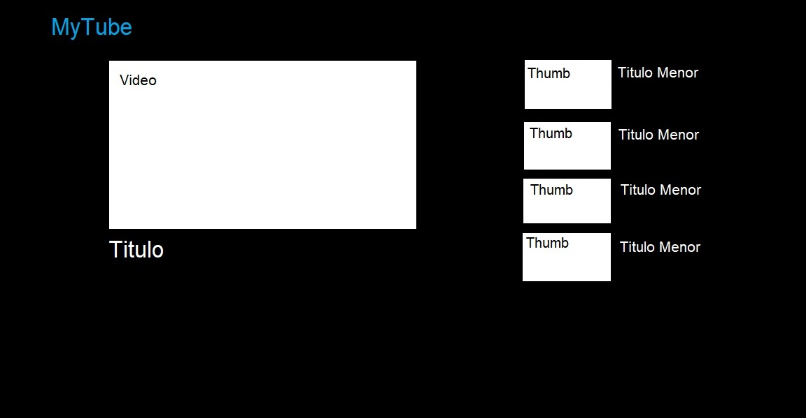

# Sumário do Projeto

Pagina de visualização dos arquivos no meu servidor web

# Partes do Projeto

- Servidor : Um servidor Apache Tomcat com os seguintes servlets, que serão feitos usando a API Servlet Javax:
    - Pagina principal (HTML) [x]
    - Lista de videos que tem no servidor no momento (Microserviço, REST) [x]
    - Thumbnails [x]
    - FTP para carregar os videos [x]
- Conexão : As portas IP do meu proprio PC e rede serão usadas. Para pegar o IP global atual do PC podemos usar alguma API ou serviço [x]
    - Para a segurança, antes do deploy, teremos um sistema de login e usuários controlados pelo próprio servidor (Especificações no web.xml) [x]
- Pagina : Pagina simples em HTML + CSS + JS
    - script.js faz o request para conseguir a lista de videos do servidor e montar a lista de videos lateral, muda e da load na fonte do video ao clicar em um dos videos laterais [x]
- Deploy: Fazer o aplicativo ser instalável/executável via JAR
    - O servidor Tomcat deve ser embedded
    - O arquivo app.properties deve ser configurável pelo input do usuário ao executar o JAR
    - O mesmo para as senhas e o usuário
    - Então vamos precisar de um main(String[] args) para fazer essa configuração toda

# Como um servidor funciona

O navegador faz um request, o servidor envia o que o navegador pediu naquele endereço

# Design Base

# Comando para usar Maven

../apache-maven-3.9.9/bin/mvn.cmd

# Como as thumbnails funcionam

O sistema vai procurar na mesma pasta uma imagem que tenha o mesmo nome do video, em png ou jpg, e enviar o link para o servlet de thumbnails